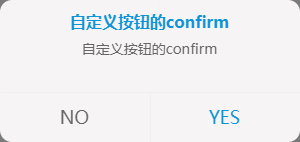

## confirm([options])
确认弹窗



**Kind**: global function

| Param | Type | Default | Description |
| --- | --- | --- | --- |
| [options] | <code>object</code> |  | 配置项 |
| [options.title] | <code>string</code> |  | 弹窗的标题 |
| [options.content] | <code>string</code> |  | 弹窗的内容 |
| [options.className] | <code>string</code> |  | 弹窗的自定义类名 |
| [options.buttons] | <code>array</code> |  | 按钮配置项 |
| [options.buttons[].label] | <code>string</code> | <code>&quot;确定&quot;</code> | 按钮的文字 |
| [options.buttons[].type] | <code>string</code> | <code>&quot;primary&quot;</code> | 按钮的类型 [primary, default] |
| [options.buttons[].onClick] | <code>function</code> | <code>$.noop</code> | 按钮的回调 |

**Example**  
```js
confirm('普通的confirm');
confirm('自定义标题的confirm', {
    title: '自定义标题'
});

confirm('带回调的confirm', function(){
    console.log('yes')
}, function(){
    console.log('no')
});

confirm('自定义按钮的confirm', {
    title: '自定义按钮的confirm',
    buttons: [{
        label: 'NO',
        type: 'default',
        onClick: function(){
            console.log('no')
        }
    }, {
        label: 'YES',
        type: 'primary',
        onClick: function(){
            console.log('yes')
        }
    }]
});
```
