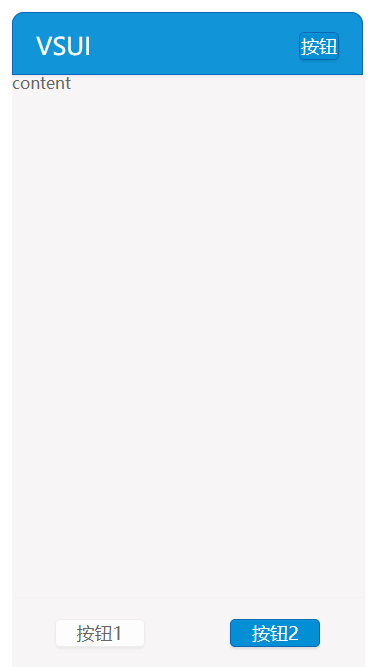

## footer

VSUI的页面底部，可以包含按钮。



**Example**
```html
<div class="vsui-footer">
    <div class="vsui-footer-btn-item">
        <a href="javascript:;" class="vsui-btn vsui-btn_white">按钮1</a>
        <a href="javascript:;" class="vsui-btn vsui-btn_blue">按钮2</a>
    </div>
</div>
```