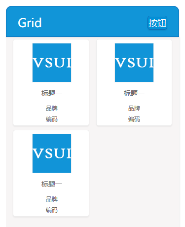

## grid
2 * n 的按钮，包含图片及一些商品信息。



**Example**
```html
<div class="vsui-grids">
    <a href="javascript:;" class="vsui-grid">
        <div class="vsui-grid__hd">
            
        </div>
        <div class="vsui-grid__bd">
            <div class="vsui-grid__title">标题一</div>
            <div class="vsui-grid__desc vsui-grid__brand">品牌</div>
            <div class="vsui-grid__desc vsui-grid__code">编码</div>
        </div>
    </a>
    <a href="javascript:;" class="vsui-grid">
        <div class="vsui-grid__hd">
            
        </div>
        <div class="vsui-grid__bd">
            <div class="vsui-grid__title">标题一</div>
            <div class="vsui-grid__desc vsui-grid__brand">品牌</div>
            <div class="vsui-grid__desc vsui-grid__code">编码</div>
        </div>
    </a>
    <a href="javascript:;" class="vsui-grid">
        <div class="vsui-grid__hd">
            
        </div>
        <div class="vsui-grid__bd">
            <div class="vsui-grid__title">标题一</div>
            <div class="vsui-grid__desc vsui-grid__brand">品牌</div>
            <div class="vsui-grid__desc vsui-grid__code">编码</div>
        </div>
    </a>
</div>
```
