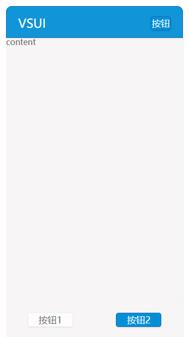

## header

VSUI的页面头部，包含标题及可能出现的按钮。



**Example**
```html
<div class="vsui-header">
    <div class="vsui-header_title">
        VSUI
    </div>
    <div class="vsui-header_btn">
        <a href="javascript:;" class="vsui-btn vsui-btn_header">按钮</a>
    </div>
</div>
```