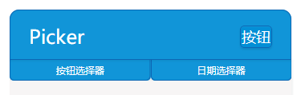
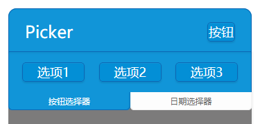
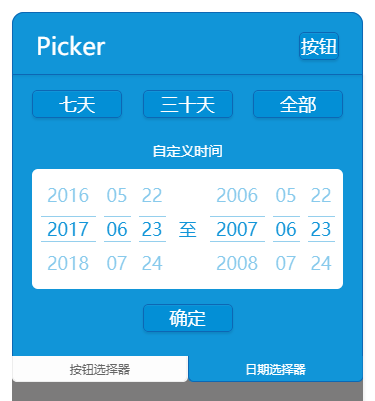

## picker([options])
按钮选择器及时间选择器







**Kind**: global function

| Param | Type | Default | Description |
| --- | --- | --- | --- |
| [options] | <code>object</code> |  | 配置项 |
| [options.tapName1] | <code>string</code> | <code>"按钮选择器"</code> | 按钮选择器标题 |
| [options.tapName2] | <code>string</code> | <code>"时间选择器"</code> | 时间选择器标题 |
| [options.btnName1] | <code>string</code> | <code>"按钮1"</code> | 按钮选择器第一个按钮 |
| [options.btnName2] | <code>string</code> | <code>"按钮2"</code> | 按钮选择器第二个按钮 |
| [options.btnName3] | <code>string</code> | <code>"按钮3"</code> | 按钮选择器第三个按钮 |
| [options.btnData1] | <code>string</code> | <code>"data1"</code> | 按钮选择器第一个按钮回调的数据 |
| [options.btnData2] | <code>string</code> | <code>"data2"</code> | 按钮选择器第二个按钮回调的数据 |
| [options.btnData3] | <code>string</code> | <code>"data3"</code> | 按钮选择器第三个按钮回调的数据 |
| [options.onChoose] | <code>function</code> | <code>$.noop</code> | 按钮选择器的回调 |
| [options.onConfirm] | <code>function</code> | <code>$.noop</code> | 时间选择器的回调 |

**Example**  
```js
VsuiPicker({
    tapName1: "按钮选择器",
    tapName2: "日期选择器",
    btnName1: "选项1",
    btnName2: "选项2",
    btnName3: "选项3",
    btnData1: "data 1",
    btnData2: "data 2",
    btnData3: "data 3",
    onConfirm: function (startDate, endDate) {
        console.log(startDate);
        console.log(endDate);
    },
    onChoose: function (data) {
        console.log(data);
    },
});```
