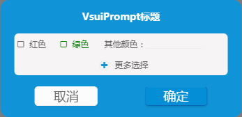

## prompt([options])
弹窗多选器



**Kind**: global function

| Param | Type | Default | Description |
| --- | --- | --- | --- |
| [options] | <code>object</code> |  | 配置项 |
| [options.title] | <code>string</code> |  | 弹窗的标题 |
| [options.className] | <code>string</code> |  | 弹窗的自定义类名 |
| [options.input] | <code>array</code> |  | 选项的详细内容 |
| [options.input[].label] | <code>string</code> | <code>"标签"</code> | 标签名称 |
| [options.input[].type]  | <code>string</code> | <code>"checkbox"</code> | 表单项类型，目前只支持checkbox，text |
| [options.input[].name]  | <code>string</code> | <code>"label"</code> | 表单项name值 |
| [options.input[].value] | <code>string</code> |  | 表单项的值 |
| [options.input[].style] | <code>string</code> |  | 表单项的css |
| [options.more] | <code>object</code> |  | 更多选项及内容 |
| [options.more.label] | <code>string</code> | <code>"标签"</code> | 标签名称 |
| [options.more.type]  | <code>string</code> | <code>"checkbox"</code> | 表单项类型，目前只支持checkbox，text |
| [options.more.name]  | <code>string</code> | <code>"label"</code> | 表单项name值 |
| [options.more.value] | <code>string</code> |  | 表单项的值 |
| [options.more.style] | <code>string</code> |  | 表单项的css |
| [options.buttons] | <code>array</code> |  | 按钮配置项 |
| [options.buttons[].label] | <code>string</code> | <code>"确定"</code> | 按钮的文字 |
| [options.buttons[].type] | <code>string</code> | <code>"primary"</code> | 按钮的类型 [primary, default] |
| [options.onConfirm] | <code>function</code> | <code>$.noop</code> | 回调 |

**Example**
```js
VsuiPrompt({
    title: 'VsuiPrompt标题',
    input: [{
        label: '红色',
        type: 'checkbox',
        name: 'color',
        value: 'red'
    }, {
        label: '绿色',
        type: 'checkbox',
        name: 'color',
        value: 'green',
        style: 'color:green'
    }, {
        label: '其他颜色：',
        type: 'text',
        name: 'color',
    }],
    more: {
         text: '更多选择',
         label: '其他色彩：',
         type: 'text',
         name: 'moreColor',
     },
    className: 'custom-classname',
    buttons: [{
        label: '取消',
        type: 'cancel',
    }, {
        label: '确定',
        type: 'submit',
    }],
    onConfirm: function (result) {
        console.log(result);
    }
});
```
