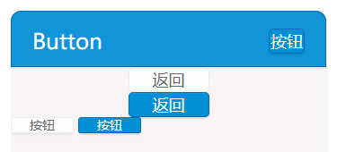

## button

VSUI的按钮，样式分为白色，蓝色，小按钮及标题用按钮



**Example**
```html
<a href="javascript:;" class="vsui-btn vsui-btn_white">返回</a>
<a href="javascript:;" class="vsui-btn vsui-btn_blue">返回</a>
<a href="javascript:;" class="vsui-btn vsui-btn_mini vsui-btn_white">按钮</a>
<a href="javascript:;" class="vsui-btn vsui-btn_mini vsui-btn_blue">按钮</a>
<a href="javascript:;" class="vsui-btn vsui-btn_header">按钮</a>```