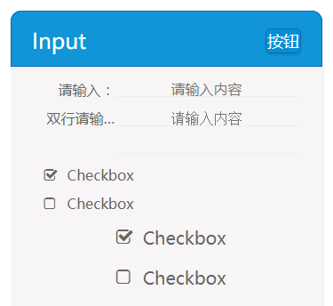

## input

input包括单行文本输入框，双行文本输入框，及两种大小的checkbox。



**Example**
```html
<form class="vsui-inputBox">
    <div class="vsui-input-text">
        <div class="name">请输入：</div>
        <input type="text" placeholder="请输入内容">
    </div>

    <div class="vsui-input-textarea">
        <div class="name">双行请输入：</div>
        <textarea rows="2" maxlength="50" placeholder="请输入内容"></textarea>
    </div>

    <label class="vsui-input-checkbox" for="a">
        <input type="checkbox" id="a" checked="checked">
        <div class="vsui-icon"></div>
        <p>Checkbox</p>
    </label>

    <label class="vsui-input-checkbox" for="b">
        <input type="checkbox" id="b">
        <div class="vsui-icon"></div>
        <p>Checkbox</p>
    </label>

    <label class="vsui-input-checkbox middle" for="c">
        <input type="checkbox" id="c" checked="checked">
        <div class="vsui-icon"></div>
        <p>Checkbox</p>
    </label>

    <label class="vsui-input-checkbox middle" for="d">
        <input type="checkbox" id="d">
        <div class="vsui-icon"></div>
        <p>Checkbox</p>
    </label>
</form>
```