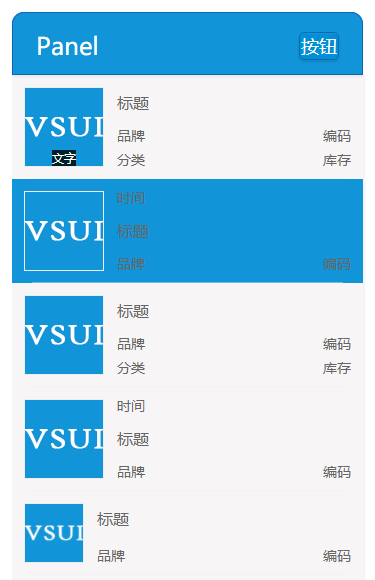

## panel

panel列出商品条目，有两种型号可选，可以添加active样式。



**Example**
```html
<div class="vsui-panel">
    <div class="vsui-panel__hd">
        
        <div class="vsui-panel__hd-footer">
            <span>文字</span>
        </div>
    </div>
    <div class="vsui-panel__bd">
        <div class="vsui-panel__title">标题</div>
        <div class="vsui-panel__row">
            <div class="vsui-panel__desc vsui-panel__brand">品牌</div>
            <div class="vsui-panel__desc vsui-panel__code">编码</div>
        </div>
        <div class="vsui-panel__row">
            <div class="vsui-panel__desc vsui-panel__class">分类</div>
            <div class="vsui-panel__desc vsui-panel__stock">库存</div>
        </div>
    </div>
</div>

<div class="vsui-panel vsui-panel-active">
    <div class="vsui-panel__hd">
        
    </div>
    <div class="vsui-panel__bd">
        <div class="vsui-panel__date">时间</div>
        <div class="vsui-panel__title">标题</div>
        <div class="vsui-panel__row">
            <div class="vsui-panel__desc vsui-panel__brand">品牌</div>
            <div class="vsui-panel__desc vsui-panel__code">编码</div>
        </div>
    </div>
</div>

<a href="javascript:void(0);" class="vsui-panel">
    <div class="vsui-panel__hd">
        
    </div>
    <div class="vsui-panel__bd">
        <div class="vsui-panel__title">标题</div>
        <div class="vsui-panel__row">
            <div class="vsui-panel__desc vsui-panel__brand">品牌</div>
            <div class="vsui-panel__desc vsui-panel__code">编码</div>
        </div>
        <div class="vsui-panel__row">
            <div class="vsui-panel__desc vsui-panel__class">分类</div>
            <div class="vsui-panel__desc vsui-panel__stock">库存</div>
        </div>
    </div>
</a>

<a href="javascript:void(0);" class="vsui-panel">
    <div class="vsui-panel__hd">
        
    </div>
    <div class="vsui-panel__bd">
        <div class="vsui-panel__date">时间</div>
        <div class="vsui-panel__title">标题</div>
        <div class="vsui-panel__row">
            <div class="vsui-panel__desc vsui-panel__brand">品牌</div>
            <div class="vsui-panel__desc vsui-panel__code">编码</div>
        </div>
    </div>
</a>

<div class="vsui-panel-mini vsui-panel">
    <div class="vsui-panel__hd">
        
    </div>
    <div class="vsui-panel__bd">
        <div class="vsui-panel__title">标题</div>
        <div class="vsui-panel__row">
            <div class="vsui-panel__desc vsui-panel__brand">品牌</div>
            <div class="vsui-panel__desc vsui-panel__code">编码</div>
        </div>
    </div>
</div>

```