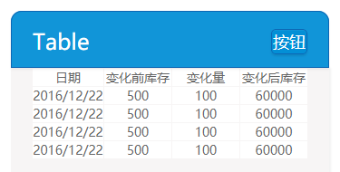

## table

表格



**Example**
```html
<div class="vsui-table">
    <table>
        <tr><td>日期</td><td>变化前库存</td><td>变化量</td><td>变化后库存</td></tr>
        <tr><td>2016/12/22</td><td>500</td><td>100</td><td>60000</td></tr>
        <tr><td>2016/12/22</td><td>500</td><td>100</td><td>60000</td></tr>
        <tr><td>2016/12/22</td><td>500</td><td>100</td><td>60000</td></tr>
        <tr><td>2016/12/22</td><td>500</td><td>100</td><td>60000</td></tr>
    </table>
</div>
```